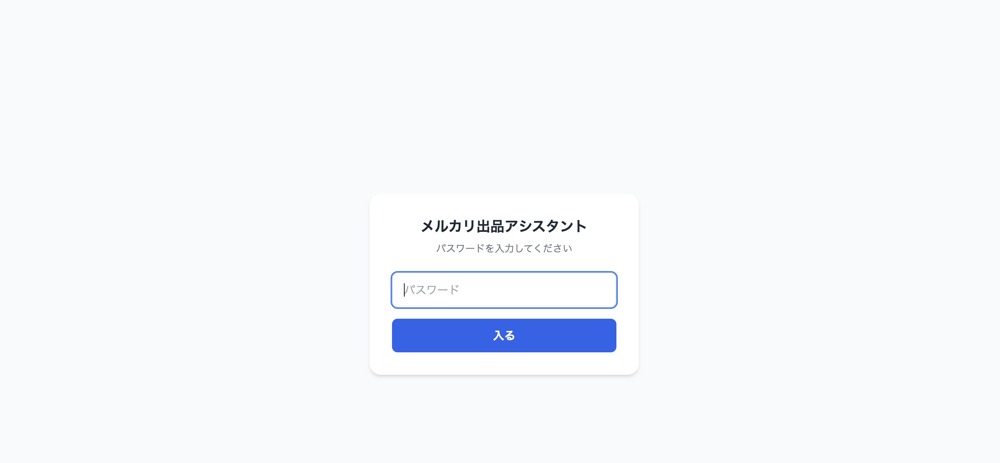
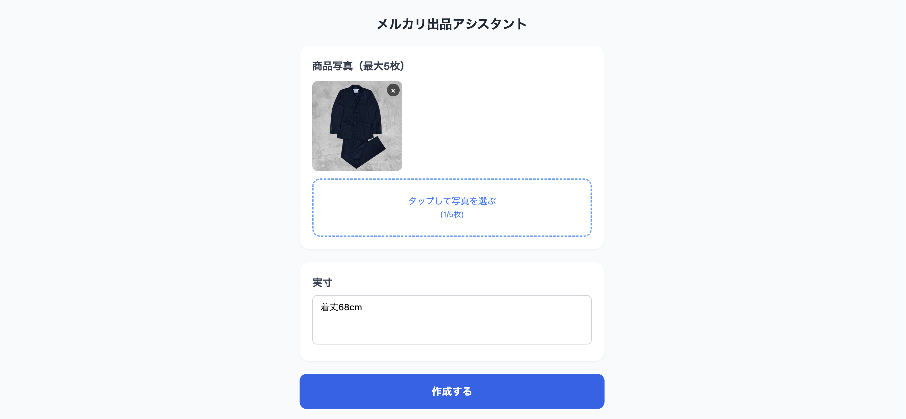
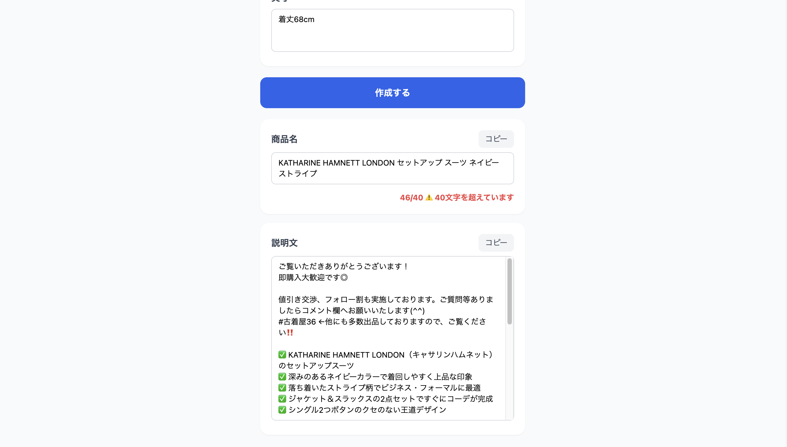

# メルカリ出品アシスタント

商品写真と実寸を渡すだけで、メルカリにそのまま貼れる**商品名**と**説明文**を自動生成する個人用 Web アプリです。

## スクリーンショット

| ログイン | 入力 | 生成結果 |
|---|---|---|
|  |  |  |

## 機能

- 商品写真のアップロード（最大5枚・プレビュー表示）
- 実寸の自由テキスト入力
- Claude API（vision）による商品名・説明文の自動生成
- 商品名の文字数カウンター（40字超過で警告）
- 生成結果をその場で直接編集
- 商品名・説明文それぞれにコピーボタン
- パスワード認証による簡易ログイン

## 技術スタック

| 項目 | 内容 |
|---|---|
| 言語 | TypeScript |
| フレームワーク | Next.js 16（App Router） |
| AI | Claude API（claude-opus-4-8 / vision） |
| スタイリング | Tailwind CSS |
| デプロイ | Vercel |

## 環境変数

`.env.local` を作成して以下を設定してください。

```env
ANTHROPIC_API_KEY=sk-ant-api03-...
ACCESS_PASSWORD=your-secret
```

Vercel にデプロイする場合は、ダッシュボードの **Settings → Environment Variables** に同じ値を登録してください。

## 開発環境の起動

```bash
npm install
npm run dev
```

`http://localhost:3000` で起動します。

## 公開 URL

https://mercari-product-generator.vercel.app/
